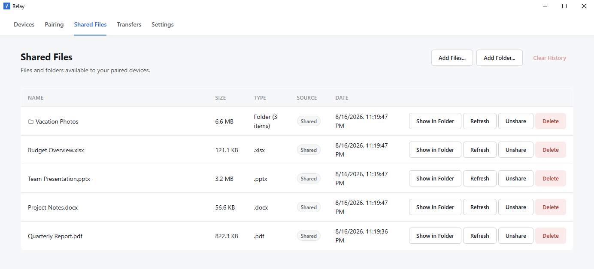
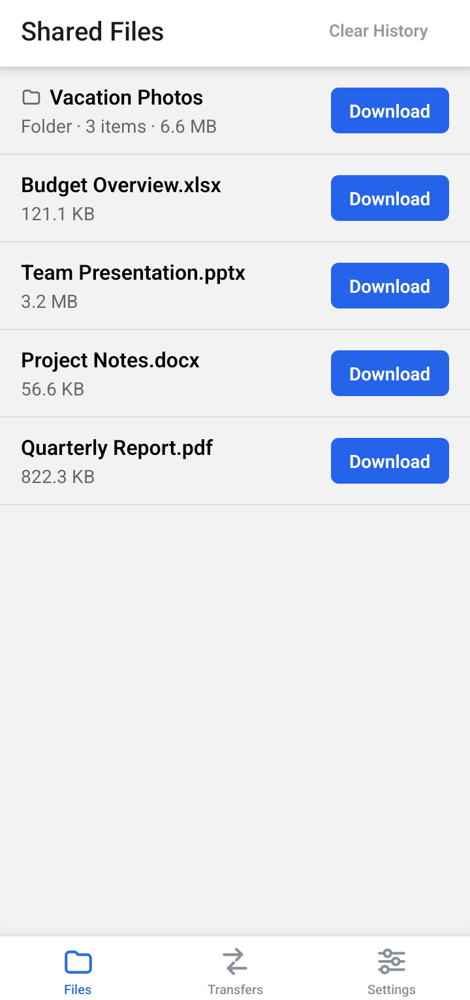

<div align="center">
  

  # Relay

  **Local file transfer between Windows and Android.**

  Send files and folders directly between your PC and your phone over the
  same Wi-Fi network or a mobile hotspot — no cloud storage, no account,
  and no internet server in between.

  [](https://github.com/MohdSaad01/Relay/releases/tag/v1.0.0)
  [](#requirements--compatibility)
  [](LICENSE)

  **[Download for Windows](https://github.com/MohdSaad01/Relay/releases/download/v1.0.0/Relay-Setup-1.0.0.exe)** ·
  **[Download for Android](https://github.com/MohdSaad01/Relay/releases/download/v1.0.0/Relay-1.0.0.apk)** ·
  [Website](https://mohdsaad01.github.io/Relay/) ·
  [GitHub Release](https://github.com/MohdSaad01/Relay/releases/tag/v1.0.0)
</div>

---

## What is Relay?

Relay is a local-first file transfer application for Windows and Android.
The desktop hosts a backend on your PC; your Android phone discovers it on
the network, pairs with it once, and transfers files directly to and from
it from then on — no middleman, ever.

Common ways to move a file between a computer and a phone — cloud drives,
messaging apps, email, a USB cable — either require an internet connection,
upload your file to a third party, or add friction. Relay skips all of
that: both devices just need to be on the same Wi-Fi network or hotspot.

## See Relay in action

<table>
<tr>
<td width="65%">
  
  <br />
  <sub><b>Desktop</b> — files and folders shared from your PC, ready for your paired phone.</sub>
</td>
<td width="35%">
  
  <br />
  <sub><b>Android</b> — the same shared files, ready to download onto your phone.</sub>
</td>
</tr>
</table>

## How it works

1. **Discover** — open Relay on your PC and phone while they're on the same
   Wi-Fi network or hotspot. The Android app finds the desktop automatically
   via a local UDP broadcast; there's no IP address to type in.
2. **Pair** — scan the QR code shown on the desktop. Relay asks you to
   approve the request on the PC before the phone is trusted — nothing
   connects without that confirmation.
3. **Transfer** — send or receive files and folders directly between the
   two devices. Every transfer proposal is accepted or rejected on the
   desktop before any bytes move.

## Features

**Transfer**
* Send a single file, several files at once, or a whole folder (including
  nested subfolders), in either direction — PC to phone or phone to PC.
* Chunked HTTP streaming with visible progress and cooperative cancellation.
* Automatic filename/folder-name conflict resolution on upload and download.

**Devices & pairing**
* Automatic discovery on the local network, or instant pairing by scanning
  a QR code — no manual IP entry.
* Every transfer requires explicit approval on the desktop; unpaired
  devices can discover Relay but never browse or move files.
* Rename a paired device, or forget and re-pair it after a network change,
  without reinstalling the app.

**Files & history**
* The desktop chooses what's shared; Android sees a sanitized list with no
  local file paths.
* A "Clear History" action on both platforms hides completed transfers
  from view without touching the underlying files or the source share.
* Files received from Android stay manageable on desktop — Open, Show in
  Folder, and Delete, alongside anything shared locally.

**Platform integration**
* Android foreground service with a live progress notification and a
  tap-to-open "download complete" notification.
* Configurable Android download location (defaults to `Downloads/Relay`).
* Desktop system tray integration for background operation.

## Download

Relay `v1.0.0` is distributed as a Windows installer and an Android APK
through [GitHub Releases](https://github.com/MohdSaad01/Relay/releases) —
no other distribution channel exists, and there is no auto-updater.

| Platform | Asset | Size |
|---|---|---|
| Windows | [`Relay-Setup-1.0.0.exe`](https://github.com/MohdSaad01/Relay/releases/download/v1.0.0/Relay-Setup-1.0.0.exe) | 119 MB |
| Android | [`Relay-1.0.0.apk`](https://github.com/MohdSaad01/Relay/releases/download/v1.0.0/Relay-1.0.0.apk) | 95 MB |

A [`SHA256SUMS.txt`](https://github.com/MohdSaad01/Relay/releases/download/v1.0.0/SHA256SUMS.txt)
checksum file is published alongside both assets. The Windows installer is
per-user (no admin rights required) and currently unsigned, so Windows will
show an "unrecognized publisher" warning on first run — see
[Known Limitations](#known-limitations). The Android APK is sideloaded (no
Play Store listing) and signed with a genuine release keystore; Android
will ask you to allow installs from whatever source you downloaded it from.

## Requirements & compatibility

| | |
|---|---|
| **Windows** | Windows 10 or 11, 64-bit |
| **Android** | Android 8.0 or later |
| **Network** | Same Wi-Fi network or mobile hotspot on both devices |
| **Pairing** | QR code scan, approved on the desktop |

## Architecture

Three components, one local network, no server in between:

```text
┌────────────────────────────────┐                              ┌──────────────────────────┐
│  Windows Desktop (Electron)     │                              │  Android (React Native)   │
│                                  │◄────────────────────────────►│                           │
│  ┌────────────────────────────┐ │   UDP discovery + REST API   │                           │
│  │ FastAPI backend             │ │                              │                           │
│  │ (embedded, auto-started)    │ │                              │                           │
│  └────────────────────────────┘ │                              │                           │
└────────────────────────────────┘                              └──────────────────────────┘
              same Wi-Fi network or mobile hotspot — no server in between
```

* **Desktop** (`desktop/`) — the host. Starts the backend as a child
  process, broadcasts its presence on the LAN, and provides the UI for
  pairing, sharing files, and approving transfers.
* **Backend** (`backend/`) — a layered FastAPI service
  (`API → Service → Repository → SQLAlchemy`) that owns business logic,
  persistence (SQLite), pairing, authentication, and byte streaming.
* **Android** (`android/`) — discovers the desktop, pairs via QR code,
  browses its shared files, and proposes/streams transfers.

Pairing requires explicit desktop approval; a paired device authenticates
every subsequent request with a session token. Relay runs over plain HTTP
on the assumption of a trusted local network — there is no transport
encryption or end-to-end encryption in Version 1. See
[`docs/10_Security.md`](docs/10_Security.md) for the full threat model and
[`docs/09_Networking.md`](docs/09_Networking.md) for discovery and firewall
behavior.

**Tech stack:** Electron, HTML/CSS/JavaScript (Desktop) · Python 3.13+,
FastAPI, SQLAlchemy, SQLite, Pydantic, Uvicorn (Backend) · React Native,
TypeScript (Android).

## Building from source

Relay is open source under the MIT License. Building from source requires
Python 3.13+, Node.js ≥ 22.11.0, and — for Android — Android Studio/JDK 17.

```bash
# Backend
cd backend
python -m venv .venv && .venv\Scripts\activate
pip install -r ../requirements-dev.txt
copy .env.example .env
uvicorn app.main:app --reload      # http://localhost:8000/api/v1, docs at /docs

# Desktop (Electron) — starts the backend automatically
cd desktop
npm install
npm start

# Android (React Native) — same Wi-Fi/hotspot as the desktop to pair
cd android
npm install
npm run android
```

Building the installable release artifacts (packaged backend, signed
installer, signed APK) is a separate, more involved process — see
[`docs/12_Packaging_Deployment.md`](docs/12_Packaging_Deployment.md).
Component-level setup and internals: [`backend/README.md`](backend/README.md),
[`android/README.md`](android/README.md).

## Documentation

`docs/` is the source of truth for Version 1's design — one canonical
document per topic:

| Topic | Document |
|---|---|
| Project vision & scope | [`docs/00_Project_Overview.md`](docs/00_Project_Overview.md) |
| Architecture & repository structure | [`docs/02_Architecture.md`](docs/02_Architecture.md) |
| Tech stack | [`docs/03_Tech_Stack.md`](docs/03_Tech_Stack.md) |
| API design | [`docs/05_API_Design.md`](docs/05_API_Design.md) |
| Networking (discovery, ports, firewall) | [`docs/09_Networking.md`](docs/09_Networking.md) |
| Security model (pairing, sessions, auth) | [`docs/10_Security.md`](docs/10_Security.md) |
| File transfer protocol | [`docs/11_File_Transfer.md`](docs/11_File_Transfer.md) |
| Packaging, signing & release process | [`docs/12_Packaging_Deployment.md`](docs/12_Packaging_Deployment.md) |
| Database schema | [`docs/13_Database_Design.md`](docs/13_Database_Design.md) |
| Test status & known open items | [`docs/14_Testing_Plan.md`](docs/14_Testing_Plan.md) |

`backend/README.md` documents the backend's internals (API routes,
services, dependency injection) in depth.

## Known limitations

Deliberate, documented Version 1 trade-offs — not open bugs:

* **No transport or end-to-end encryption.** Relay runs over HTTP on the
  assumption of a trusted local network (`docs/10_Security.md`).
* **No resume, checksum verification, compression, or bandwidth limiting**
  on transfers; progress is polled rather than pushed over a socket.
* **The Windows installer is unsigned** — no free code-signing option puts
  Relay's own name on a certificate. Windows will show an "unrecognized
  publisher" warning on first run.
* **No auto-updater** on either platform — updates are manual: download
  the newer version and install it over the old one.
* A couple of narrow, non-blocking UI sync gaps on Android (e.g. the Files
  and Transfers screens don't live-sync a shared "Clear History" marker
  until the app restarts).

Full, current, and periodically re-audited list: `docs/14_Testing_Plan.md` §6.

## License

This project is licensed under the MIT License. See [LICENSE](LICENSE) for
details.
